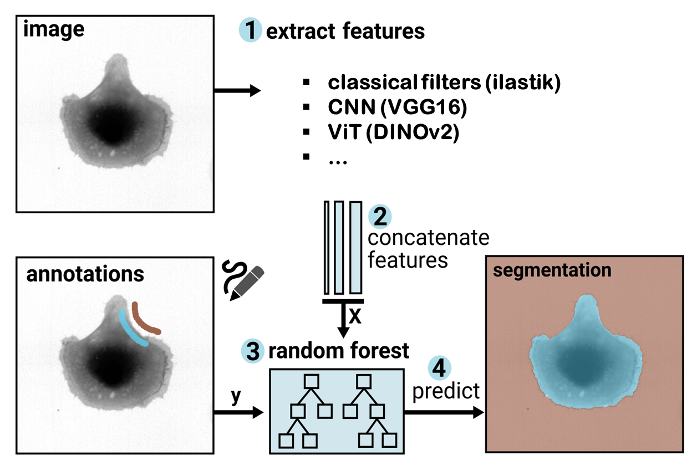

# seghub

Welcome to seghub. This is a toolbox for semantic segmentation in python. The main idea is to combine multiple ways of feature extraction with a random forest classifier (and possibly other classification algorithms such as kmeans). The idea of combining a convolutional neural network for feature extraction with a random forest classifier originates from Lucien Hinderling of the [pertzlab](https://www.pertzlab.net/) at the University of Bern, where I did my Master Thesis.

Please note that the intention behind seghub is not to develop fastest-possible solutions. Much rather it shall be a set of tools and ways to explore and compare different approaches to semantic segmentation.

**If you decide to use this tool or some of the code in any sort of public work, please do contact me and cite this repository. I would be excited.**

## Requirements

The requirements for this package can be found in the file [req.yml](./req.yml). As usual, you can create a conda environment with those packages with

    conda env create -f req.yml

After this, you can load the conda environment using `conda activate seghub_env`. 

Note that the use of scikit-video requires a working installation of [ffmpeg](https://ffmpeg.org/). If this is not available, you can replace it by any other means to load videos as numpy arrays, or limit the analyses to images.

## Installation
You can install seghub via pip using

    pip install git+https://github.com/quasar1357/seghub.git

After this, you can simply import the functions needed in Python, e.g. `from seghub.dino_utils import get_dinov2_feature_space`.

## Get started
You can either directly use the various functions, e.g. to import per-patch features with the DINOv2 vision transformer use

    from seghub.dino_utils import get_dinov2_patch_features

    patch_features = get_dinov2_patch_features(test_image)

Please read carefully the detailed docstrings to get more information about the functions.

## Scripts
- [classif_utils.py](./src/seghub/classif_utils.py): functions for easy application of utilities that are helpful for classification, such as PCA and K-means.
- [convpaint_utils.py](./src/seghub/convpaint_utils.py): functions for feature extraction using [convpaint](https://github.com/guiwitz/napari-convpaint/) with the convolutional neural network VGG16.
- [dino_utils.py](./src/seghub/dino_utils.py): functions for feature extraction using [DINOv2](https://github.com/facebookresearch/dinov2), a state-of-the-art vision transformer model.
- [ilastik-utils.py](./src/seghub/ilastik-utils.py): functions for feature extraction using classical filterbanks implemented in the popular segmentation tool "[ilastik](https://www.ilastik.org/)".
- [rf_utils.py](./src/seghub/rf_utils.py): wrapper functions to combine feature extraction with a random forest classifier from sklearn (train and predict models).
- [util_funcs.py](./src/seghub/util_funcs.py): various utility functions used in the other scripts.

## Notebooks
The notebook [seghub_function_tests.ipynb](./notebooks/seghub_function_tests.ipynb) shows examples for using functions from the scripts mentioned above.

## Issues
If you encounter any problems, I am grateful if you file an [issue](https://github.com/quasar1357/seghub/issues) along with a detailed description.
